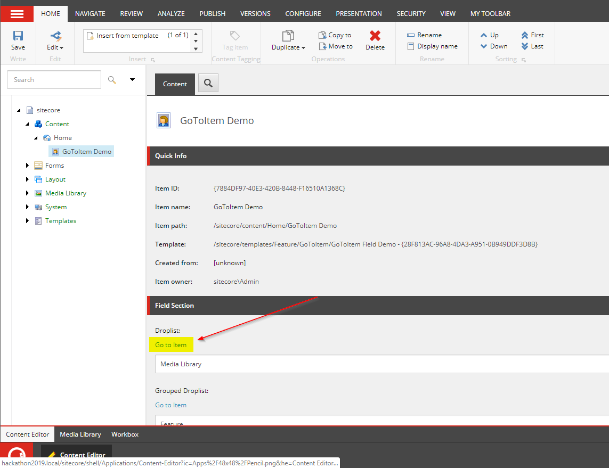
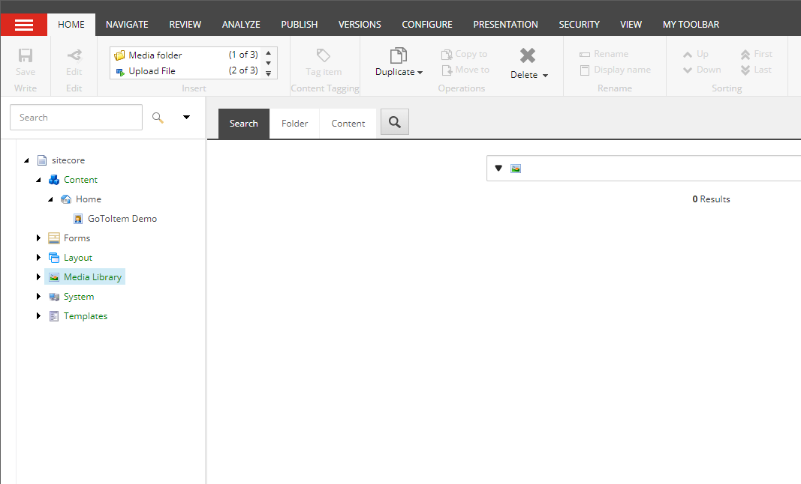
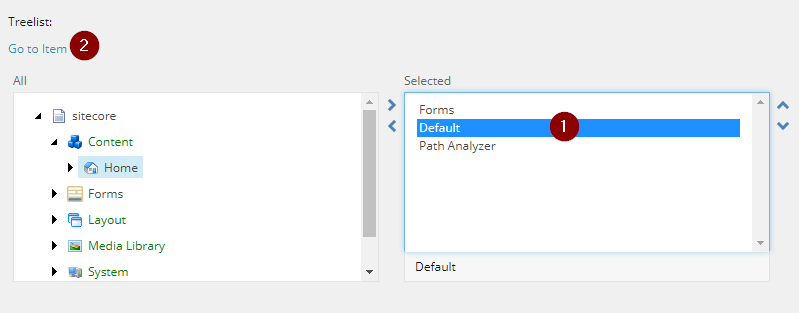

# $name's Submission - Sitecore Hackathon 2019
### Team Members: Szymon Dabrowski, Sasha Kachanov, Naim Alkouki
## Summary
**Category: Best enhancement to the Sitecore Admin (XP) UI for Content Editors & Marketers** 
Our module solves a frustrating problem that all Sitecore Developers face. It's really surprising that this feature hasn't yet been included into the Sitecore Content Editor UI.

The purpose of our module is to allow for easy navigation to the selected item in Reference Fields and Multilist Fields. It adds a clickable link to the selected item above the field input box on Reference and Multilist Fields.

## Pre-requisites
This has been tested with Sitecore 9.1. It is likely compatible with other versions as well but has not been tested.

## Installation
1. Use the Sitecore Installation wizard to install the [package](https://github.com/Sitecore-Hackathon/2019-name/blob/master/sc.package/GoToItem%20Release-1.zip)
2. There will be a merge conflict if you already have a /sitecore/templates/Feature, there will be a merge conflict. Select Merge/Merge and click apply.
3. Your module is now ready to use.

## Configuration
There is no required configuration for this module to work. The package installs the necessary configuration files.

## Usage
We provided a sample item located here: /sitecore/content/Home/GoToItem Demo
This item can shows you the basic functionality for each type of field.

1. Reference and Multilist Fields have a new link above the field input box.

2. Clicking on this link now takes you to the selected item.

3. For fields with multiple selected values, first select a value and then click on the "Go to Item" link.

## Video
Here is a link demoing our module:

